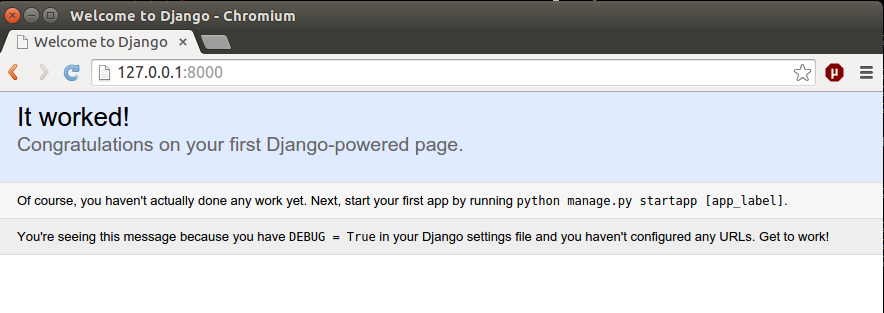
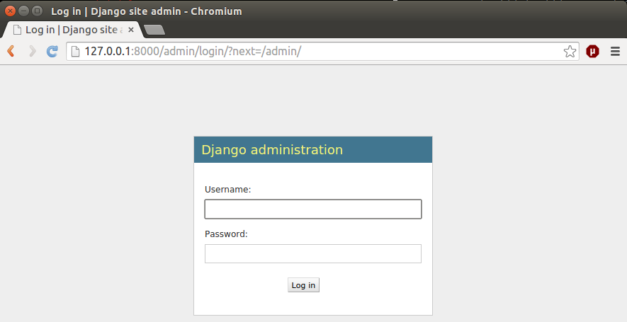
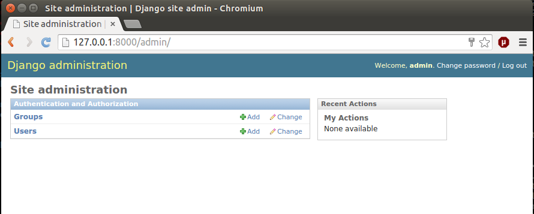

=================================================
Learning practical databases via a Django web app
=================================================

Preliminary Steps
=================

----------------
Create a project
----------------

We will presume you are in the directory you would like to be in and in the
virtualenv which has django and psycopg2 installed.

Our research will have a title, and this will be the project. A project can
be made of smaller apps, but are all collected together. Think in terms of
having multiple sheets in the same spreadsheet file - each sheet fulfils a
different purpose, even if their data may overlap.

We are going to call our project library.

::

    (venv)$ django-admin.py startproject library

This will create a library directory, with a bunch of files in it.

::

    ├── library
    │   ├── library
    │   │   ├── __init__.py
    │   │   ├── settings.py
    │   │   ├── urls.py
    │   │   └── wsgi.py
    │   └── manage.py

* The top level library is our project. 
* The second level library folder is that which holds the project level 
  details - general settings and URLs. 
    * wsgi.py is part of deployment and we almost certainly wont need to 
      touch it. 
    * __init__.py is a python file that tells python that this is a library
      or an app.
* manage.py is a special file that we also shouldn't need to touch, but 
  helps us manage our Django project from the command line.
  
Once we have made a couple of small changes to these files, we wont need to
come back very often. Most of the work happens in the apps themselves.

We edit library/library/settings.py focusing on these fields, using the details
that were set up earlier::

    DATABASES = {
        'default': {
            'ENGINE': 'django.db.backends.postgresql_psycopg2',
            'NAME': 'db',
            'USER': 'db_user',
            'PASSWORD': 'db_password',
            'HOST': '127.0.0.1',
            'PORT': '5432',
        }
    }

Here we have set the database connection. Now we can populate the database with
some of the default tables that Django needs to do it's job. To do this we will need to change into our new project directory.

::

    (venv)$ cd library
    (venv)library$ python manage.py migrate

We will use this command every time we make a change to the data models. Let's
check that everything has installed correctly thus far.

::

    (venv)$ python manage.py runserver
    Performing system checks...

    System check identified no issues (0 silenced).
    March 04, 2015 - 22:52:05
    Django version 1.7.4, using settings 'library.settings'
    Starting development server at http://127.0.0.1:8000/
    Quit the server with CONTROL-C.
 
As you can see, we now have the Django internal testing server running, 
and if you go to the web address http://127.0.0.1:8000/ there will be a
msg declaring success. If not, now is the time to panic. I find setting 
fire to things theraputic.

--------------------
Create our first app
--------------------

Depending on the size and shape of our data, we may need to do a little bit of 
pen and paper work to determine the best way to break our data down into it's 
constituent parts. In most cases, each app should be relatively small and just 
do one or two things. In this case, we will make our app a little bigger, 
because it will be our only app. 

At the end of this I will give an example of a more complex app and how to go 
about mentally mapping that into applications.

The brief synopsis of what we want is:

 - a collection of books 
    - some of those books will be "source texts" - Australian literature
    - some of those books will be "target texts" - foreign language books with
      at least a link to a "source text"
 - a collection of writers
    - some of those writers will be "source text" Authors. They may have one or
      more "source texts"
    - some of those writers will be Translators. We will presume they have a 
      single language other than English. They may have one or more "target 
      texts". 

In various ways we will want to cross reference and group these texts in a way
that makes investigating the data relatively simple. 

Our app will be based on this simple model, and we will grow it as we see room
for improvement and as our users ask for more capabilities.

.. note::
    
    There is lots over overlooked dark magic going on under the hood.
    I am deliberately not showing this because it can be arcane and isn't
    stritly necessary to get from where you are to getting a DB working.
    In someways this information can be valuable, and if you decide that
    a Django based database is for you, it will be worth investigating 
    further (the Django site has a great intro tutorial). But suffice to 
    say that it is out of scope for today.

We have already used the name library for the project, so let's call the app 
"texts". With a few exceptions, you can call the project and the app almost
anything you would like. The convetion is to use a hyphen for multi word needs.

::

    (venv)library$ python manage.py startapp texts

If we take a look at what was created, we can see some new files:

::

    ├── library
    │   ├── library
    │   │   ├── __init__.py
    │   │   ├── __init__.pyc
    │   │   ├── settings.py
    │   │   ├── settings.pyc
    │   │   ├── urls.py
    │   │   └── wsgi.py
    │   ├── manage.py
    │   └── texts
    │       ├── admin.py
    │       ├── __init__.py
    │       ├── migrations
    │       │   └── __init__.py
    │       ├── models.py
    │       ├── tests.py
    │       └── views.py

We now have a directory called texts, and within that a number of files.
Straight up I'll say teh __init__.py, the migrations directory and the 
tests.py we will not be using today and are somewhat esoteric anyway. Any
Djangoistas that are reading this will kick my arse for saying don't worry 
about tests, but seriously, don't worry about tests for another year.

So there are three other files. We are literally halfway to a functional 
database.

* models.py is where we describe our data and what we can do to our data.
* views.py is where we describe exactly how we want to manipulate our data, 
    depending on URL.
* admin.py is the simplest way we can build an interface to our data
    (ie, "the website")

==================
The Down and Dirty
==================

Defining our Models
===================

When building databases, it is important to think about how we will represent 
our data in the database - the data description or database schema. Having 
said that, thinking about database models of your data doesn't come naturally
to *anyone*, so trial and error is as good a way to go as any.

Open models.py in an editor and we add this:

::

    """ models.py 
        contains the models for:
        books, sourcetexts and translated texts
        authors, translators
    """
    from django.db import models

The first five lines are a comment that tell us what is in this file and what
we expect it to do. This is merely good practice rather than necessary.

The sixth line tells us (and the software) we will be using the Django model 
system.

Let's build an initial model for our data. We put this in the models.py file, 
directly below the import command:

::

    class Author(models.Model):
        """ The underlying model for writers """
        first = models.CharField(u'First Name', max_length=30)
        other = models.CharField(u'Other Names', max_length=30, blank=True)
        last = models.CharField(u'Last Name', max_length=30)
        dob = models.DateField(u'Date of Birth', blank=True, null=True)

Breaking this down - we are creating a class called a Author. This will be a db
table, and you should think of it in relation to a page on a spreadsheet.

Each author will have a first name, an other name, a last name and a date of 
birth. Each of the name fields is made up of characters ("CharField"), has 
a special name (u'First Name' for ease of use later, and a maximum length.

You will note that the other field has "blank=True". This means that sometimes
we will enter a writer that will not have an other name and that is ok. This
is one of the ways that Django and the database make sure that your data is 
of the correct type.

Finally you will see that dob is a DateField, a special type of field that 
is optimised for dates and date calculations (eg: today-yesterday=1 day) and
"null=True", which is similar to "blank=True". Yse both are necessary and no
I wont explain the difference unless you insist. Again, it's arcane and 
generally unnecessary.

So we have a writer. Let's make a translator:

::

    LANGUAGE_CHOICES = (
      (u'it', u'Italian'),
      (u'ja', u'Japanese'),
      (u'es', u'Spanish'),
      (u'zh-cn', u'Simplified Chinese'),
      (u'zh-tw', u'Traditional Chinese'),
      (u'en', u'English'),
    }

    class Translator(models.Model):
        """ The translators """
        first = models.CharField(u'First Name', max_length=30)
        other = models.CharField(u'Other Names', max_length=30, blank=True)
        last = models.CharField(u'Last Name', max_length=30)
        dob = models.DateField(u'Date of Birth', blank=True, null=True)
        original_name = models.CharField(u'Source Name', max_length=40, blank=True)
        language = models.CharField(u'language', max_length=3, choices=LANGUAGE_CHOICES)
   

Ok, now we have some more interesting work. The Translator is very similar to 
an Author. The main changes are a new name ("original_name"), which is included 
so that we can have the romanised version of their name in the same name space 
as the Author's, but so we can also have their untranslated name.

Finally we have the language field. Note that it is a character field, with a 
max length, but also the "choices" field. And you will note that we have 
defined a small collection of languages. In the available choices, Italian 
will be stored in the database as "it", but we will see it written as 
"Italian". 

When we build the website front end, by describing language like this means we will
see a drop down list of languages rather than an open text field. Adding a new
language is as easy as adding a new line to the LANGUAGE_CHOICES dictionary, eg::

    ('kl', 'Klingon'),

This is easy right?

Let's create a book model:

::

    class Book(models.Model):
      """ the abstract book model """
      title = models.CharField(u'title'), max_length=100)
      publisher = models.CharField(u'publisher', max_length=40)
      date = models.DateField(blank=True, null=True)
      place = models.CharField(u'place', max_length=20)
      pages = models.CharField(u'pages', blank=True)

TODO - Lachlan, look into the DateField and see how to enter the year only, as 
that is a sufficient level of precision for year of publish.

Nothing you haven't seen here, you could have done this yourself at this point.
Some brief explanations. date is date pubished - some books are published 
multiple times, often with new or changed content, so this is important when
we are looking at the source text of a translation. 

Place is because sometimes a large publishing company will print different 
in different countries (or the same book in different territories, etc).

You will see that pages is a character field, even though it will be number. 
We only use the IntegerField when we want to do mathematics on the data. We
will not want to do any pages maths - we are collecting this as "meta-data" 
in order to distinguish between different published copies of the same book.

Now, there are two types of books - source and target - and we don't want to 
code more than we have to. So let's reuse that Book class to make our next
models:

::

    class SourceText(Book):
      """ the source text (presumed but not necessarily english) """
      language = models.CharField(u'language', max_length=20, choices=LANGUAGES, default=u'en')
      authors = models.ManyToManyField(Author, verbose_name=u'List of Authors')

Note two important points here. When we define SourceText, we make it a copy of
the Book model instead of the models.Model. This means that it will have all 
the things that a Book has, as well as the new fields we created. 

The other thing to note is that we have now linked the Book and the Author. 
And you can see that we have acknowledged that some texts have more than one
Author by making it a ManyToManyField. This means "any one Book can have one 
or Many Authors; and any Author may be linked to one or many Books". There 
is no particular reason to attach authors to books, rather than books to 
authors except it seems more intuitively correct. There is no absolute 
correct though, and the changes needed would be minor to flip it.

Because we have created the SourceText as an extension of the Book model, 
we need to add a little to the Book model:

::

    class Book(models.Model):
        """ the abstract book model """
        title = models.CharField(u'title'), max_length=100)
        publisher = models.CharField(u'publisher', max_length=40)
        date = models.DateField(blank=True, null=True)
        place = models.CharField(u'place', max_length=20)
        pages = models.CharField(u'pages', blank=True)

        class Meta: 
            """ Some meta data """ 
            ordering = ["title"] 
            abstract = True

Here you can see I'm telling Django that when you list Books, I want them 
listed alphabetically. Abstract means that there will never actually be a 
Book object, only SourceText objects. Let's see why:

::

    class TargetText(Book):
        """ the translated text """
        language = models.CharField(u'language', max_length=20, choices=LANGUAGES)
        source_text = models.ForeignKey(SourceText, related_name=u'source',
                        verbose_name=u'Source Text')
        translators = models.ManyToManyField(Translator, verbose_name=u'List of Translators')

Here we get to see the last of our real models. There's nothing surprising 
here, but importantly you can see that we are making sure that a Translated
Text is connected to a Source Text. We make this a ForeignKey because any
particular Translated Text will be based off only one SourceText. We think
of this like "any one Translated Text will only have a single Source Text; 
any SourceText may have one or many Translated Texts" - a one to many 
relationship compared to the many to many of the books/author's relationship
described above.

In the TargetText, you will see that the sourec_text link also has the option 
"related_name=u'source'". This gives us a lot of power later - when we are
searching for all the translated texts for a particular source text we can 
access those books by calling the target_text.source field.

TODO - Lachlan, check that the last sentence is true and makes sense.

Building the actual Database itself
===================================

So now we have a description of what our data will look like in texts/models.py 
and our library/settings.py knows sufficient details to create the database. 
The last thing we need to do is to "register" our texts app with the library 
project. 

Open library/settings.py, find the section titled INSTALLED_APPS and add texts
to the bottom of it:

::

    INSTALLED_APPS = (
        'django.contrib.admin',
        'django.contrib.auth',
        'django.contrib.contenttypes',
        'django.contrib.sessions',
        'django.contrib.messages',
        'django.contrib.staticfiles',
        'texts', # you should only need to add this last app
    )

When we created the project earlier, we told you about migrating everytime the
data schema changed. We have changed models, so let's see what happens when we 
migrate the new settings:

:: 

    (venv)library$ python manage.py makemigrations
    Migrations for 'texts':
      0001_initial.py:
        - Create model Author
        - Create model SourceText
        - Create model TargetText
        - Create model Translator
        - Add field translators to targettext

Django has done all the heavy lifting for us. Well, it has made a start.

As I noted above, almost everytime you build a database you think to yourself
"damn I wish I had done it like *this* instead of like *that*. Migrations is 
how we manage these changes. For instance, if you decide to add a favourite
colour to an Author, or change the max_length of a book's title, you can do so
now because the migrations know how to handle it. 

Now that we have saved our migration data, lets apply the migration:

::

    (venv)library$ python manage.py migrate
    Operations to perform:
      Apply all migrations: admin, texts, contenttypes, auth, sessions
    Running migrations:
      Applying contenttypes.0001_initial... OK
      Applying auth.0001_initial... OK
      Applying admin.0001_initial... OK
      Applying sessions.0001_initial... OK
      Applying texts.0001_initial... OK

If we used some software like phpPgAdmin, we would be able to see that the 
database tables have been built according to our specification.

phpPgAdmin is handy, but we are here to write a Django app. The models are 
defined and the database now reflects those models. Time to build a web 
interface.

Django comes with an "admin" interface out of the box, but it is also trivial
to build a sleek interface if you prefer. First I'll show the admin interface
and I'll look at the prettier one later in the tutorial.

Data goes in
============

At the moment the database is a blank slate, it has nothing in it, only a 
shape. As per most websites, you will need to login. Django comes with an
authorization system out of the box, but we still need to make a user:

::

    $ python manage.py createsuperuser
    Username: admin
    Email address: a@b.com # I am a LAZY PROGRAMMER
    Password: **********
    Password (again): *********
    Superuser created successfully.

Ok. Now we can login. Let's start the engine up.

::

    $ python manage.py runserver

Potential: Use this for search:
https://github.com/etianen/django-watson/blob/master/README.markdown
