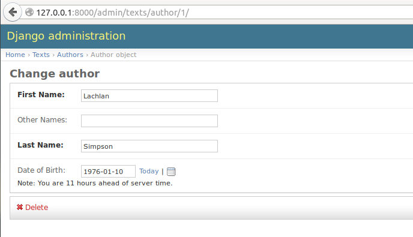
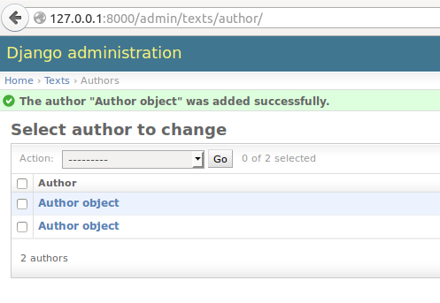
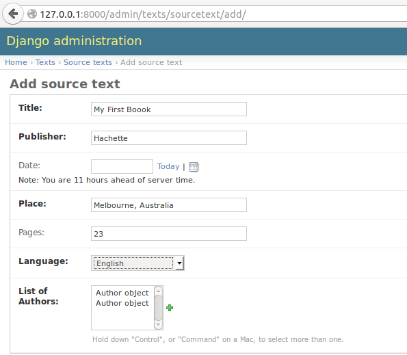

=================================================
Learning practical databases via a Django web app
=================================================

Tutorial 2
==========

-----------------------------------------------------
In which we bump into and quickly solve easy problems
-----------------------------------------------------

Mandatory Fields and Data Validation
------------------------------------

When you click on the add button next to Authors, you will see the "Add 
author" interface

While it's mostly self explanitory, I'll walk you through some of the 
subtlties.

First, notice that First Name and Last Name are in bold? That's because they 
are mandatory fields. If you go back and look at where we defined the Author
model, you will see that we used "blank=True" on two fields. This indicates 
that those fields were **not** mandatory. Anything without "blank=True" is
a mandatory field.

If you try to save an object (an object is an instance of a model) without a 
name, you will see that the admin interface won't let you.

The second and third notable advantages of the admin interface are in the date 
field. You will see that there is, importantly, a very easy "today" button and
calendar to quickly enter dates via mouse. You can obviously type them as well.

The other notable here is what happens when you enter a non date string into 
that field - eg "aaaa". You will see that when you try to save it will be 
rejected as "invalid". 

One of Django's greatest advantages is that when you define a field on a model
Django takes that definition as what constitutes a valid entry. Anything that
isn't valid can't be entered. 

As a database user, this is invaluable. Garbage in, garbage out is a famous
data science saying. Incomplete and poorly formatted data is every data 
scientists worst nightmare. 

Without having to any more work than necessary, we have data validation out of
the box. Django just saved you hours of heartache, which your typing fingers
should appreciate.

Anonymity
---------

After you have saved your first Author object with success you will be taken to
a screen that looks like this

.. image:: imgs/add_author_save_1.png

Looks good. But look what happens when we add another Author.

Ok, now we have a problem. We can't tell which object is which author. And 
here, when we add a text, we see the problem compounded - we can't distinguish
the authors from each other to assign one. Bugger.

