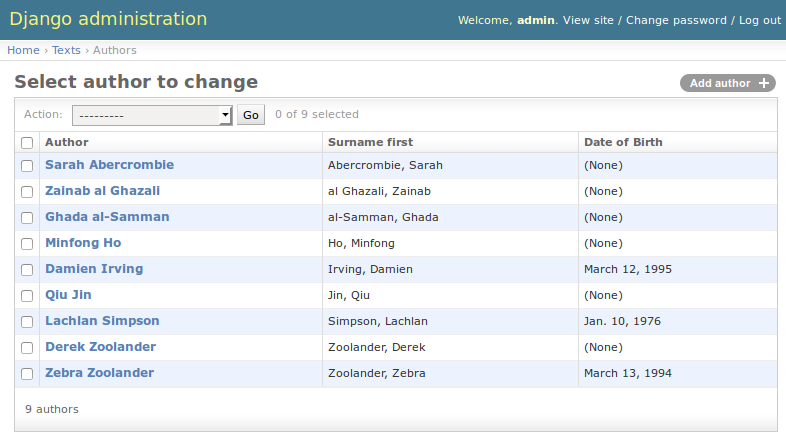

=================================================
Learning practical databases via a Django web app
=================================================

Tutorial 2
==========

-----------------------------------------------------
In which we bump into and quickly solve easy problems
-----------------------------------------------------

Mandatory Fields and Data Validation
------------------------------------

When you click on the add button next to Authors, you will see the "Add 
author" interface

.. image:: imgs/add_author_1.png

While it's mostly self explanitory, I'll walk you through some of the 
subtlties.

First, notice that First Name and Last Name are in bold? That's because they 
are mandatory fields. If you go back and look at where we defined the Author
model, you will see that we used "blank=True" on two fields. This indicates 
that those fields were **not** mandatory. Anything without "blank=True" is
a mandatory field.

If you try to save an object (an object is an instance of a model) without a 
name, you will see that the admin interface won't let you.

The second and third notable advantages of the admin interface are in the date 
field. You will see that there is, importantly, a very easy "today" button and
calendar to quickly enter dates via mouse. You can obviously type them as well.

The other notable here is what happens when you enter a non date string into 
that field - eg "aaaa". You will see that when you try to save it will be 
rejected as "invalid". 

One of Django's greatest advantages is that when you define a field on a model
Django takes that definition as what constitutes a valid entry. Anything that
isn't valid can't be entered. 

As a database user, this is invaluable. Garbage in, garbage out is a famous
data science saying. Incomplete and poorly formatted data is every data 
scientists worst nightmare. 

Without having to any more work than necessary, we have data validation out of
the box. Django just saved you hours of heartache, which your typing fingers
should appreciate.

Anonymity
---------

After you have saved your first Author object with success you will be taken to
a screen that looks like this

.. image:: imgs/add_author_save_1.png

Looks good. But look what happens when we add another Author.

Ok, now we have a problem. We can't tell which object is which author. And 
here, when we add a text, we see the problem compounded - we can't distinguish
the authors from each other to assign one. Bugger.

.. image:: imgs/add_source_text_0.png

Let's fix it.

Crack open *texts/models.py* and find the Author class. We will add a 
**method** to that class.

::

    class Author(models.Model):
        """ The underlying model for writers """
        first = models.CharField(u'First Name', max_length=30)
        other = models.CharField(u'Other Names', max_length=30, blank=True)
        last = models.CharField(u'Last Name', max_length=30)
        dob = models.DateField(u'Date of Birth', blank=True, null=True)

        def __unicode__(self):
            return '%s %s' % (self.first, self.last)

There's a lot in those two lines of code, and we will try to answer as many of
them as possible.

    * When we are programming in this fashion, we define classes of objects and
      we can give those classes, and their resulting objects, *methods*. Those 
      methods are pure programming - from within there you can do whatever 
      you want. Obviously we like to keep them as short and understandable as
      possible, but they will get longer. Methods are "actions" cf the model's
      fields.
    * Most of the methods you write will not have underscores surrounding 
      them. The reasoning is beyond the scope of this tutorial, suffice to
      say that they are "special internal functions" within Django. 
    * self? WTF is self? Ok. We have a **CLASS** that defines a **MODEL**. 
      That **MODEL** is an abstraction. When we create a new instance of that
      abstraction, we call it an **OBJECT**. Each of those objects will have
      the ability to call any **METHOD** associated with it - note the 
      indentation of the method definition being one level in from class 
      definition. The **SELF** is how the method knows which object's 
      variables to use when doing it's actions.
    * In case you missed it, the return line will return the string for the
      object as defined by "firstname lastname" or "<first> <last>". As we
      would expect.
    * This special method is an identity reference on an object and is very
      very useful, as we will see later. Don't worry, I'll point it out when it
      happens.

.. todo:: Is it worth making the analogy to spreadsheets?

          The Model is the spreadsheet page

          The Class is the headings in row 1

          The Object is each line below the heading (the data)

          The Methods are the columns at the end of the Class Fields that reference
          other fields

          The Self is the equivalent of referencing something in the same line in a 
          spreadsheet function - ie the reference to A2 and B2 in col C

          ===== ========= ======== ===================
          index column A  column B column C
          ===== ========= ======== ===================
             1  **First** **Last** **NAME**
             2  Lachlan   Simpson  =STRCAT(A2, B2)
          ===== ========= ======== ===================
 

Ok, now when we refresh the Author list page, we see named objects. That's much
easier to use. 

But, like all good solutions, it now raises two more problems - do the rest of
our models need an identity reference? In our use case, yes. But you wont 
always - that will be something you will need to decide on a per model basis.
The other problem is sort order. In the English speaking world we tend to order
lists of people alphabetically by last name.

I'll leave the first problem as an exercise for the reader.

For the second problem, there are a couple of solutions, which can be done
individually *or* collectively. Let's do them all.

Create a new method
-------------------

Let's make this dead easy and just create a new method that returns "<last>, 
<first>" instead of "<first> <last>".

::

    class Author(models.Model):
        """ The underlying model for writers """
        first = models.CharField(u'First Name', max_length=30)
        other = models.CharField(u'Other Names', max_length=30, blank=True)
        last = models.CharField(u'Last Name', max_length=30)
        dob = models.DateField(u'Date of Birth', blank=True, null=True)

        def __unicode__(self):
            return '%s %s' % (self.first, self.last)

        def surname_first(self):
            return '%s, %s' % (self.last, self.first) 

We can see how this works because we understand programming - we wont see it
in action immediately, but will come back to it.

Add a sort order
----------------

If you recall, when we were defining the Book class as an abstract class, we
also added the Meta variable *ordering*. We can apply this to the Author class
as well.

::
    
    class Author(models.Model):
        """ The underlying model for writers """
        first = models.CharField(u'First Name', max_length=30)
        other = models.CharField(u'Other Names', max_length=30, blank=True)
        last = models.CharField(u'Last Name', max_length=30)
        dob = models.DateField(u'Date of Birth', blank=True, null=True)

        class Meta:
            ordering = ['last', 'first']
            # ordering = ['-last', '-first'] would order reverse alphabetically 
            # ordering = ['last', 'first', 'dob'] would order alpha, then by DOB
    
        def __unicode__(self):
            return '%s %s' % (self.first, self.last)

        def surname_first(self):
            return '%s, %s' % (self.last, self.first) 

Note that the ordering of the methods and the Meta class don't matter, only 
the indentation does. Traditionally we keep them ordered for readability, and 
the order I choose is: Meta, __special_methods__, normal_methods with the 
last two being alphabetically ordered internally.

Now that we have two solutions in place, let's add some extra authors so that
we can see them working when we implement the change.

As you can see, I've added a bunch of extra authors. The only sorting that 
seems to be happening is in the order that they were entered. Now I'll 
uncomment my Author's Meta class in models.py and it will turn out exactly as
expected.

Excellent. 

Expanding our visible Information
---------------------------------

There's not a lot of information on that Author list page, so let's learn how 
to put more information onto it for better eyeballing. At the same time, we'll
be able to see how the new function is working.

Let's jump back into *texts/admin.py* and make some changes.

::

    from django.contrib import admin
    from texts.models import Author, Translator, SourceText, TargetText
    
    class AuthorAdmin(admin.ModelAdmin):
        list_display = ['__unicode__', 'surname_first', 'dob']
    
    admin.site.register(Author, AuthorAdmin)
    admin.site.register(Translator)
    admin.site.register(SourceText)
    admin.site.register(TargetText)

As you can see, we've added a new class - AuthorAdmin - which is based on 
Django's ModelAdmin class. We've added a couple of extra fields to the list
that are available, and we have "registered" this with the admin interface.

How does it look?

Perfect. How great is that - our function has worked, and we can see that our 
field 'dob' has been rendered as 'Date of Birth' rather than dob. This is good,
we talked about it when we first started building the Author model in tute 1.
(and you would have seen it in in the "Add Author" interface as well)

----------------------
Dammit, forgot a field
----------------------

So we've now created some models and added them to our admin interface. It's 
looking good.

But we realised that we wanted to record some more information on the models we
have. 

Now we will make two changes to the models that will help us understand the 
relationship between *texts/models.py* and the underlying database, and also
how we might start getting some juicy information out of the information we 
have.

Adding a new field to a model
-----------------------------

After entering a couple of books, we decide that we want to record the colour
of the cover of each SourceText. Let's get in there and add it to the 
SourceText model.

::

    class SourceText(Book):
        """ the source text (presumed but not necessarily english) """
        language = models.CharField(u'language', max_length=20, choices=LANGUAGE_CHOICES, default=u'en')
        authors = models.ManyToManyField(Author, verbose_name=u'List of Authors')
        cover_colour = models.CharField('Colour', max_length=10, blank=True)

Great. We reload the server, but we don't see the cover_colour because the 
underlying database tables don't know about it yet. We need to perform a 
migration. 

First, make the migration.

:: 

    (venv)library$ python manage.py makemigrations
    Migrations for 'texts':
      0002_auto_20150313_0456.py:
        - Change Meta options on author
        - Change Meta options on translator
        - Add field cover_colour to sourcetext
    

Then we apply the migration.

::    

    (venv)library$ python manage.py migrate
    Operations to perform:
      Synchronize unmigrated apps: staticfiles, messages
      Apply all migrations: admin, texts, contenttypes, auth, sessions
    Synchronizing apps without migrations:
      Creating tables...
        Running deferred SQL...
      Installing custom SQL...
    Running migrations:
      Rendering model states... DONE
      Applying texts.0002_auto_20150313_0456... OK

Most of that looks like typical command line guff, but there aren't any errors,
so let's presume it worked and go check. You should be able to add a colour to 
a SourceText in add or edit mode.

To see them in the list of SourceTexts, we'll add the cover_colour to the 
*texts/admin.py*.

::

   class SourceTextAdmin(admin.ModelAdmin):
        list_display = ['title', 'publisher', 'place', 'cover_colour']

And now we restart the server and check the page. 

Boom. Easy.

Adding a new field to the Admin interface
-----------------------------------------

Right, that's nice, but it's also banal. Can we do something more complex - 
like count the number of characters in an Author's name?

Of course we can. We can represent almost anything you can represent in python.
Open *texts/models.py* and add this function to the Author model.
 
::
    
    def name_length(self):
        return len(self.first) + len(self.last)

Then we make the minor change to *texts/admin.py*

::

   class AuthorAdmin(admin.ModelAdmin):
        list_display = ['__unicode__', 'surname_first', 'dob', 'name_length']

Adding a filter
---------------

Suppose we have a really large data set and would like to be able to eyeball
some parts of the data independantly?

Easy. Open *texts/admin.py* and add

::

    class TranslatorAdmin(admin.ModelAdmin):
        list_display = ['__unicode__', 'original_name', 'language']
        list_filter = ['language']

Now if we look at our translators list:

And then we select a filter:

.. note:: You can see which filter has been selected three ways: the results 
          given, the filter on the right hand side, and if you look in the URL
          you will see it represented as well. You can hand craft URLs if you 
          like to but Django probably has a function for thay

End Tutorial 2. 

As you can see, Django is quite powerful out of the box. In tutorial three we 
will see some more power functions available to us.

  
